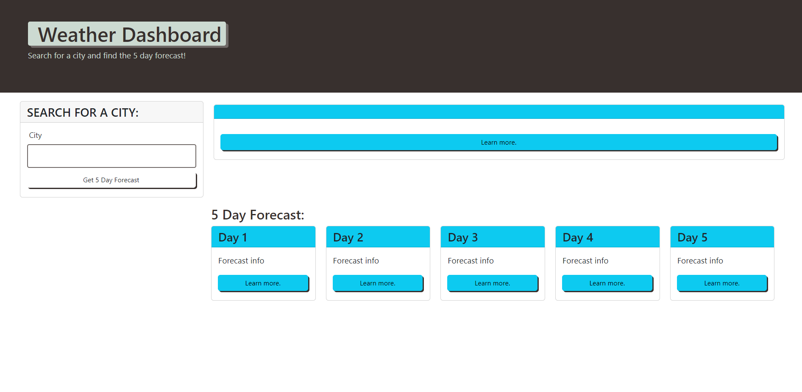
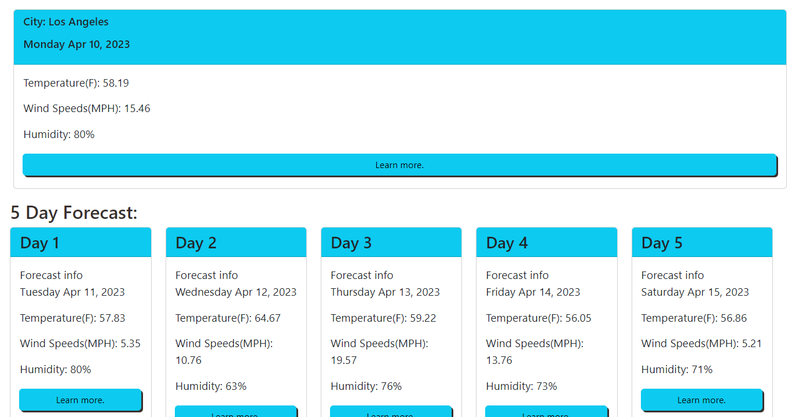

# Weather Forecast
This is a web application for users to see the current forecast for the current day as well as the next 5 days based on which city they search!

## Technology Used 

| Technology Used         | Resource URL           | 
| ------------- |:-------------:| 
| HTML    | [https://developer.mozilla.org/en-US/docs/Web/HTML](https://developer.mozilla.org/en-US/docs/Web/HTML) | 
| CSS     | [https://developer.mozilla.org/en-US/docs/Web/CSS](https://developer.mozilla.org/en-US/docs/Web/CSS)      |   
| Git | [https://git-scm.com/](https://git-scm.com/)     |  
| JavaScript | [https://developer.mozilla.org/en-US/docs/Web/javascript](https://developer.mozilla.org/en-US/docs/Web/javascript) |
| Bootstrap | [https://getbootstrap.com/](https://getbootstrap.com/)    |
| JQuery    | [https://jquery.com/](https://jquery.com/)    |

## Description

[Visit the Deployed Site](https://bryannguyen9.github.io/Weather-Forecast/)

This project is a website that allows users to view the forecast for a specific searched city.

The Weather Forecast application allows users to search a city and then see updated weather information based on each day for the next 6 days including the current day. Displaying the date, the temperature, wind speeds, and humidity.

Again here is a link to my fully deployed website: 
[Site Landing Page](https://bryannguyen9.github.io/Weather-Forecast/)

## Table of Contents

* [Mock Up](#mock-up)
* [Code Example](#code-example)
* [Usage](#usage)
* [Learning Points](#learning-points)
* [Author Info](#author-info)
* [Credits](#credits)
* [License](#license)

## Mock-Up

The following image shows the web application's appearance and functionality:



## Code Example

Here is an example of my getApi() function that allows the users to when inputting a city name it will use the weather api to search the forecast data.

```javascript
  function getApi() {
    var currentWeatherQueryURL = "http://api.openweathermap.org/data/2.5/weather?q=" + cityInput.value + "&units=imperial&appid=" + API_KEY;
    var fiveDayForecastQueryURL = "http://api.openweathermap.org/data/2.5/forecast?q=" + cityInput.value + "&units=imperial&appid=" + API_KEY;

    fetch(currentWeatherQueryURL)
        .then(function (response) {
            console.log(response);
            if (response.status === 200) {
                return response.json();
            }
            else {
                throw new Error('Error fetching weather data');
            }
        }).then(function(data){
            console.log(data);
            console.log("Name ", data.name);
            var currName = document.createElement('p');
            currName.textContent = "City: " + data.name;
            currentCityHeader.append(currName);
            //added dayjs for date
            var today = dayjs(today).format('dddd MMM DD, YYYY');
            currentCityHeader.append(today);

            var currTemp = document.createElement('p');
            currTemp.textContent = "Temperature(F): " + data.main.temp;
            cityInfoContainer.append(currTemp);

            var currWind = document.createElement('p');
            currWind.textContent = "Wind Speeds(MPH): " + (((data.wind.speed)/1609.34)*3600).toFixed(2);
            cityInfoContainer.append(currWind);

            var currHumidity = document.createElement('p');
            currHumidity.textContent = "Humidity: " + data.main.humidity + "%";
            cityInfoContainer.append(currHumidity);

    // make another API request for the 5-day forecast data
    fetch(fiveDayForecastQueryURL)
        .then(function (response) {
            if (response.status === 200) {
                previousCities.unshift(cityInput.value);
                localStorage.setItem("cities", JSON.stringify(previousCities));
            return response.json();
            } else {
            throw new Error('Error fetching weather data');
            }
        }).then(function (data) {
            try {
            // check if data and data.list are defined
                if (data && data.list) {
                    console.log(data);
                    // rest of your code for displaying current weather

                    // loop through 5 day forecast data
                    for (var i = 0; i < 5; i++) {
                    // display forecast data for each day

                    //need a way to identify which exact forecastData container to append dayData to at end need another index for day containers.
                        var dayData = document.createElement('div');
                        dayData.classList.add('day-data');

                        var date = dayjs(data.list[i*8].dt_txt).format('dddd MMM DD, YYYY');
                        var dateEl = document.createElement('p');
                        dateEl.textContent = date;
                        dayData.append(dateEl);                   

                        var temp = document.createElement('p');
                        temp.textContent = "Temperature(F): " + data.list[i*8].main.temp;
                        dayData.append(temp);

                        var wind = document.createElement('p');
                        wind.textContent = "Wind Speeds(MPH): " + (((data.list[i*8].wind.speed)/1609.34)*3600).toFixed(2);
                        dayData.append(wind);

                        var humidity = document.createElement('p');
                        humidity.textContent = "Humidity: " + data.list[i*8].main.humidity + "%";
                        dayData.append(humidity);

                        $(`#day-${i+1}`).append(dayData);
                    }
                } else {
                    throw new Error('Unexpected response format');
                }
            } catch (err) {
                console.error(err);
                currName.textContent = "Error fetching weather data";
                currentCityHeader.append(currName);
                }
        }).catch(function (error) {
            console.log(error);
            currName.textContent = "Error fetching weather data";
            currentCityHeader.append(currName);
        });
    })
}

```

## Usage
 
Here you can see the home page of the weather forecaster:


Here you can see that users are able to type in a city to search and a button to submit their input:


Here you can see that after the user submits their input the cards populate with the forecast information for their desired city:




## Learning Points 

There was a lot of stopping points in this project. I really got stumped at different points such as configuring the cards using bootstrap, being able to parse through the api request information and find what I needed, as well as ordering through a loop to get the specific data I wanted as the Weather API used 5 day forecast data but in 3 hour increments.

I also was not able to figure out local storage and save the users past searches so that they could refer back to them.

These are some links that helped me:

1. [W3 schools](https://www.w3schools.com/jsrEF/api_fetch.asp)
2. [Stack-Overflow](https://stackoverflow.com/questions/61337464/how-to-use-local-storage-to-store-data-from-an-api)
3. [Stack-Overflow](https://stackoverflow.com/questions/16303954/setting-button-text-via-javascript)

## About Me

Hi, my name is Bryan Nguyen I am an up and coming full-stack web developer working
on getting into the space with projects that support both my growth, belief, and imagination. I hope to one day work within the realm of AI, web-development, and even site-reliability/the space of cyber-security.

## My links

* [Portfolio](https://bryannguyen9.github.io/Bryan-Nguyen-Portfolio/)
* [LinkedIn](https://linkedin.com/in/bryannguyen9)
* [Github](https://github.com/bryannguyen9)


## Credits

### Special thanks to David Chung: 
 
 * His Github Portfolio: [David-Chung-Github](https://github.com/dchung13/)
 * His Linked-In: [David-Chung-LinkedIn](https://www.linkedin.com/in/david-chung-77141526b/)
 * His Portfolio Site: [David-Chung-Portfolio](https://dchung13.github.io/David-Chung-Portfolio/) 

 ### Special thank to David Vo:

 * His Github Portfolio: [David-Vo-Github](github.com/daevidvo)
 * His linked-in: [David-Vo-LinkedIn](https://www.linkedin.com/in/daevidvo)

### Special thanks to these reference websites that taught me different functionalities within my website for me to create a seamless experience for users.

1. [W3 schools](https://www.w3schools.com/jsrEF/api_fetch.asp)
2. [Stack-Overflow](https://stackoverflow.com/questions/61337464/how-to-use-local-storage-to-store-data-from-an-api)
3. [Stack-Overflow](https://stackoverflow.com/questions/16303954/setting-button-text-via-javascript)

## License

MIT License

Copyright (c) [2023] [Bryan-Nguyen]

Permission is hereby granted, free of charge, to any person obtaining a copy
of this software and associated documentation files (the "Software"), to deal
in the Software without restriction, including without limitation the rights
to use, copy, modify, merge, publish, distribute, sublicense, and/or sell
copies of the Software, and to permit persons to whom the Software is
furnished to do so, subject to the following conditions:

The above copyright notice and this permission notice shall be included in all
copies or substantial portions of the Software.

THE SOFTWARE IS PROVIDED "AS IS", WITHOUT WARRANTY OF ANY KIND, EXPRESS OR
IMPLIED, INCLUDING BUT NOT LIMITED TO THE WARRANTIES OF MERCHANTABILITY,
FITNESS FOR A PARTICULAR PURPOSE AND NONINFRINGEMENT. IN NO EVENT SHALL THE
AUTHORS OR COPYRIGHT HOLDERS BE LIABLE FOR ANY CLAIM, DAMAGES OR OTHER
LIABILITY, WHETHER IN AN ACTION OF CONTRACT, TORT OR OTHERWISE, ARISING FROM,
OUT OF OR IN CONNECTION WITH THE SOFTWARE OR THE USE OR OTHER DEALINGS IN THE
SOFTWARE.
